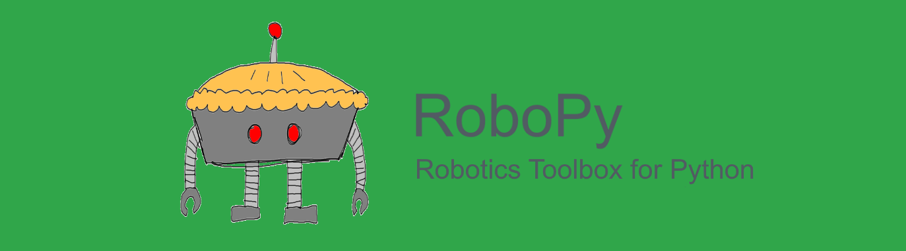
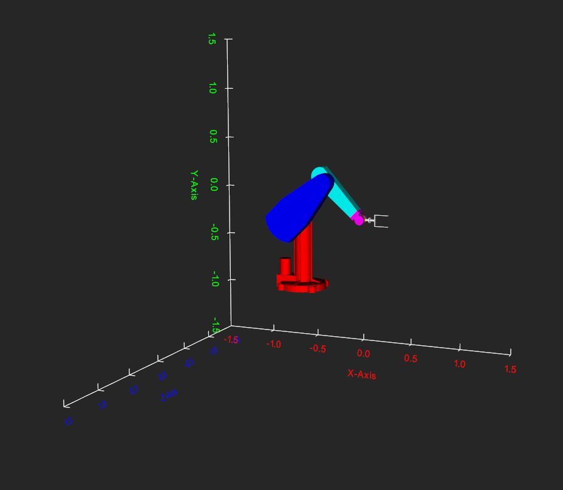
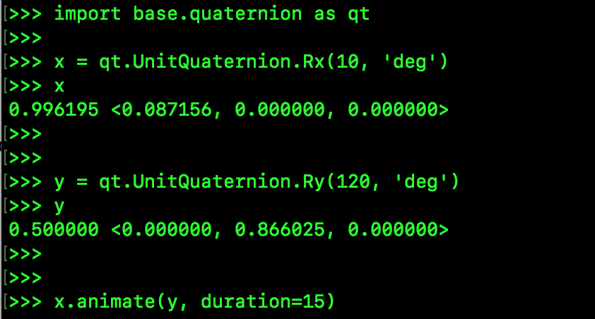
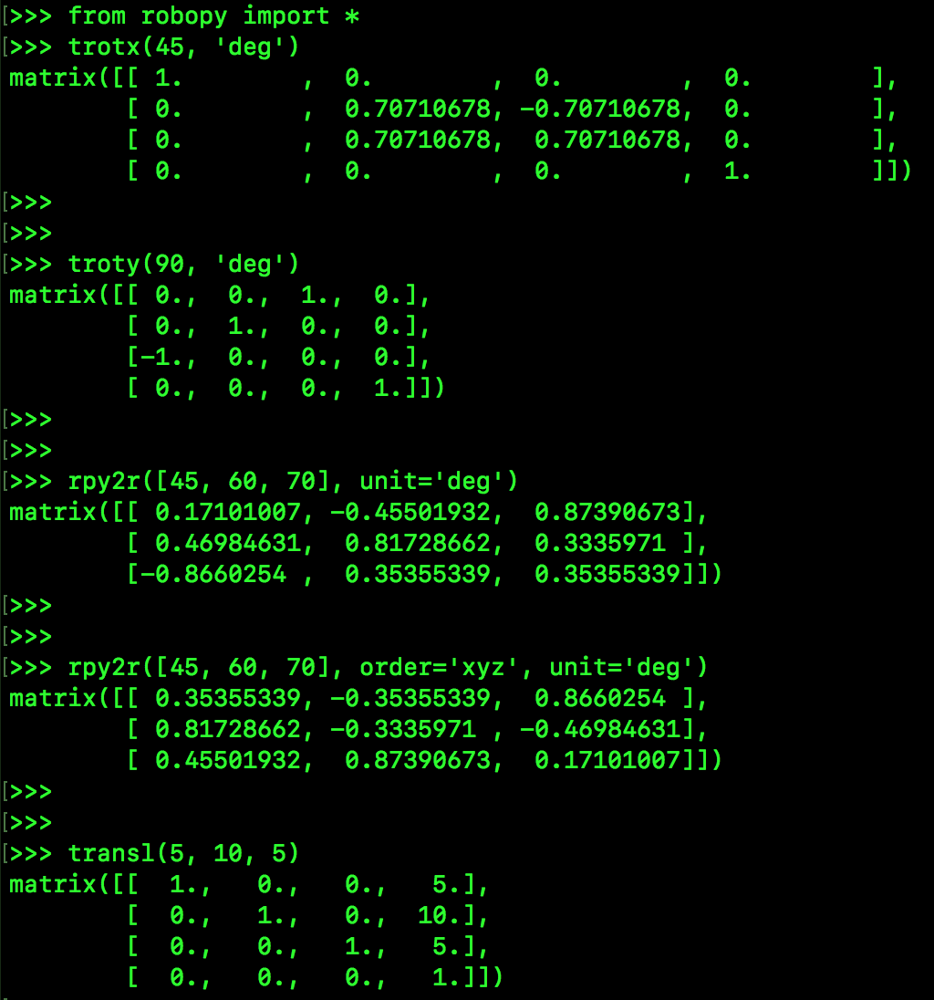
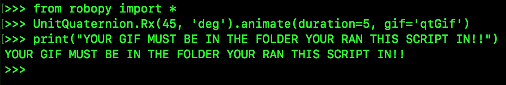
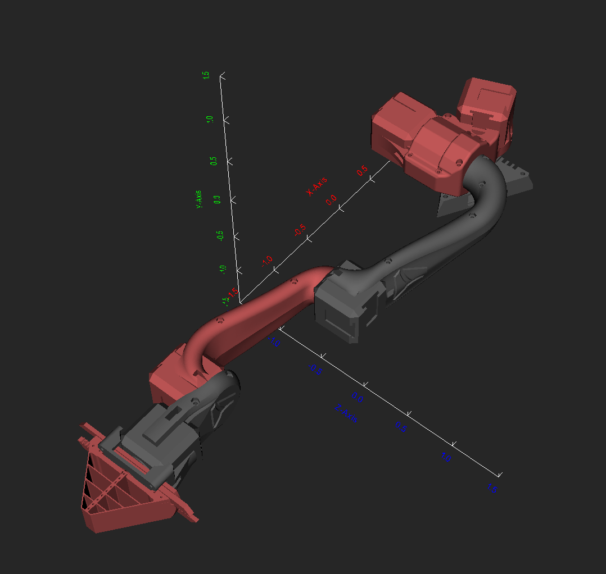

[](https://travis-ci.org/adityadua24/robopy)
[](https://pypi.python.org/pypi/robopy)
[](https://opensource.org/licenses/MIT)

A Python 3 implementation of Peter Corke's Robotics Toolbox
- **Website:** https://adityadua24.github.io/robopy/
- **Bug reports:** https://github.com/adityadua24/robopy/issues

**Dependencies:**
- [VTK](https://www.vtk.org/)
- [Matplotlib](https://matplotlib.org/)
- [NumPy](http://www.numpy.org/)
- [numpy-stl](https://pypi.org/project/numpy-stl/)
- [Pillow](https://python-pillow.org/)
- [Scipy](https://www.scipy.org/)

**Supporting:**
- [IPython](http://ipython.org/)
- [Jupyter](https://jupyter.org/index.html)
- [Spyder](https://www.spyder-ide.org/)

**To install:**

*<font color="red">
This is an RTB for Python Porting Project development version derived from
RoboPy v1.0.8 and should only be installed and run in a cloned repository workspace.
</font>*

````
python3 setup.py install
````

**Jupyter Notebook Example:**

[nbviewer](https://nbviewer.jupyter.org/github/gedeschaines/robopy/blob/ipynb/notebooks/poseVTK/poseVTK.ipynb)

[](https://mybinder.org/v2/gh/gedeschaines/robopy/ipynb)

**Puma 560 simulation:-**

_Click on the image to see a VR simulation_

<a href="https://youtu.be/kWSJNwEWhRM"></a>

**UnitQuaternions:-**

_Click on the image to see UnitQuaternion animation_

<a href="https://youtu.be/AyiGMnGzESs"></a>

**Transformation functions:-**



**Make a gif:-**



**Pose plot:-**


**Orion5:-**


